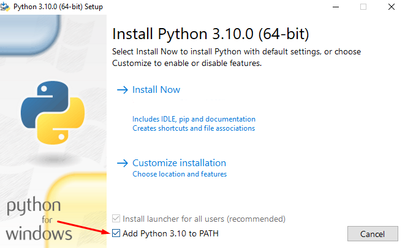

## Prerequisites
In order to run the scripts and the RabbitMQ broker, please follow the instructions below.
1. Install docker
https://www.docker.com/products/docker-desktop

2. Install python
If you haven't installed python yet, please download it:
https://www.python.org/about/gettingstarted/

When installing python on windows, make sure to tick the following option in the installation shield:



3. Install the pika library for python (command line)
```
python -m pip install pika --upgrade
```
Pika is a python implementation of the *AMQP 0-9-1* protocol used by RabbitMQ.

## Getting started 
First, please clone the repository of our workshop:
```sh
git clone https://github.com/sebivenlo/ESDE_2021_RabbitMQ
```
Make sure that you change your directory to the repository:
```sh
cd ESDE_2021_RabbitMQ
```
To start the message broker, simply execute the following command in the console. 

```
docker-compose up
```

After the docker container has pulled the rabbitmq image, you can check whether the docker container runs by visiting the following website:
[RabbitMQ Management UI](http://127.0.0.1:15672/)

The default user credentials for this web interface are as follows:
```
username: guest
password: guest
```


[← Previous chapter](presentation/index.html) | [Back to start page](index.md) | [Next chapter →](exercises.md)